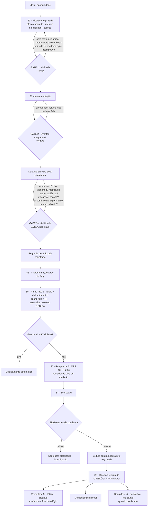
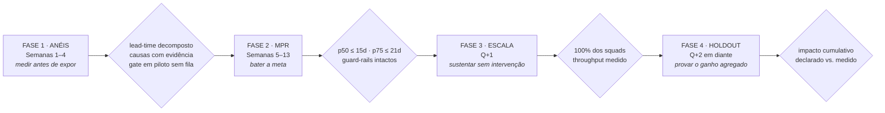

# Programa Quinze Dias

**Plano de desenvolvimento da plataforma RAVelocity em quatro fases, estruturado sobre o framework SQR de ramp (Kohavi, cap. 15)**

Documento de programa · versão 1 · setembro/2026
Companheiro de [`sintese-kohavi-lead-time.md`](./sintese-kohavi-lead-time.md), que contém a fundamentação técnica de cada item citado aqui.

---

## 1. A tese, em uma frase

> **Vamos rampar a plataforma do mesmo jeito que pedimos aos squads que rampem seus experimentos: em quatro fases, cada uma com um objetivo distinto e um critério de saída explícito — contendo risco antes de escalar, medindo antes de declarar vitória, e provando no fim que o ganho agregado foi real.**

Essa não é uma analogia de retórica. As quatro fases do ramp existem porque tentar fazer as três coisas ao mesmo tempo — mitigar risco, medir e aprender — produz um processo que não faz nenhuma bem. O mesmo vale para um programa de plataforma: tentar entregar features, provar impacto e mudar cultura simultaneamente no primeiro trimestre é o padrão de falha mais comum desse tipo de iniciativa.

A consequência prática é que **o programa tem um resultado comprometido para este quarter e um horizonte que vai além dele**, com a fronteira entre os dois declarada em vez de implícita.

---

## 2. Por que quatro fases (e por que essa estrutura se vende bem)

| Fase do ramp de um experimento | Objetivo | Fase equivalente do programa | Período |
|---|---|---|---|
| 1. Pré-MPR | Mitigar risco antes de expor | **Anéis** — instrumentar, diagnosticar, pilotar | Semanas 1–4 |
| 2. MPR | Medir com máxima sensibilidade | **MPR** — entregar e provar a meta do quarter | Semanas 5–13 |
| 3. Pós-MPR | Escalar com segurança operacional | **Escala** — 100% dos squads, self-service | Q+1 |
| 4. Holdout / replicação | Aprender o efeito duradouro | **Holdout** — provar o ganho agregado | Q+2 em diante |

A estrutura resolve quatro problemas de comunicação executiva de uma vez:

- **Dá um resultado datado neste quarter** sem prometer transformação cultural em 90 dias.
- **Explica por que a primeira fase não entrega feature** — ela é o anel de contenção de risco, e o risco aqui é construir a feature errada.
- **Torna o programa auditável**: cada fase tem critério de saída, e não se avança sem cumpri-lo. É o mesmo rigor que pedimos aos squads.
- **Demonstra o método pelo próprio método.** Uma área de experimentação que roda seu roadmap por intuição tem um problema de credibilidade que nenhum slide resolve.

### Diagrama 1 — A mesma forma, duas leituras

```
%  do          FASE 1          FASE 2           FASE 3        FASE 4
tráfego     mitigar risco     MEDIR         operacional     aprender
   ▲     velocidade × risco  vel. × qualidade
100│                                        ┌──────────────┐
   │                                        │              └──────┐ 90%
 50│                    ┌───────────────────┘                     │
   │            ┌───────┘   MPR ~7 dias                           │
  2│   ┌────────┘                                                 │
   0└───┴────────┴───────────────────┴──────────────┴─────────────┴──▶ tempo
       anéis    dial       ÚNICA FASE QUE           carga        holdout
     a,b,c,d  automático   PRODUZ DECISÃO         + cleanup    + replicação

PROGRAMA  │  Semanas 1–4  │   Semanas 5–13    │      Q+1      │   Q+2 →
          │    ANÉIS      │       MPR         │    ESCALA     │  HOLDOUT
          │ diagnosticar  │  bater a meta     │  sustentar    │  provar
```

O desenho acima é o esqueleto. A versão apresentável está na peça visual que acompanha este documento; a estrutura é a mesma.

---

## 3. Fase 1 — Anéis (Semanas 1–4)

**Objetivo:** medir antes de expor. Ao fim desta fase sabemos onde estão os 30 dias, com dado e não com opinião — e testamos os gates em um anel pequeno antes de submeter a empresa inteira a eles.

**O risco que esta fase contém:** construir features de plataforma com base em hipótese sobre o comportamento dos squads. É o risco mais caro do programa, porque ele só se revela no fim do quarter, quando não há mais tempo de corrigir.

### Entregas

| # | Entrega | Por quê |
|---|---------|---------|
| 1.1 | Timestamps por estágio S1–S8 no modelo de dados | sem isso, nenhuma afirmação sobre lead-time é verificável |
| 1.2 | Registro do **início efetivo** (primeira exposição real), além do nominal | corrige a medição de experimentos client-side |
| 1.3 | Painel de portfólio: p50 e p75 por estágio, por squad, por plataforma | o instrumento de navegação do programa inteiro |
| 1.4 | Auditoria dos experimentos hoje no ar | ganho imediato: MPR estourado, alocação assimétrica, SRM ignorado, cleanup pendente |
| 1.5 | Entrevistas com os 3 squads de maior gap, classificadas em C1–C8 | evidência que prioriza a fase 2 |
| 1.6 | Piloto do gate de desenho com 2 squads voluntários (**anel a**) | testar a trava antes de expor todo mundo |

### Critério de saída

- Lead-time decomposto e publicado, com p50 e p75 por estágio.
- Pelo menos três causas dominantes identificadas **com evidência quantitativa**, não só com relato.
- Gate de desenho rodando em piloto com **tempo mediano de passagem abaixo de 30 minutos** — se o gate cria fila, ele não sai do piloto (anti-padrão nº 6 do documento técnico).

### O que se comunica ao fim da fase 1

Um slide único: *"os 30 dias são assim"* — a decomposição real, com a barra maior destacada. É o slide que mais muda a conversa, porque hoje ninguém na empresa sabe a resposta, e porque ele transforma uma meta abstrata numa lista de alvos concretos.

---

## 4. Fase 2 — MPR (Semanas 5–13): a meta do quarter

**Objetivo:** entregar o conjunto de features que a fase 1 provou serem os gargalos, e levar o p50 de 30 para 15 dias.

**Trade-off dominante:** velocidade × qualidade. É aqui que a tentação de bater a meta pelo caminho errado aparece — e é por isso que os guard-rails da seção 7 valem tanto quanto a meta.

### Backlog de referência

A lista definitiva sai da evidência da fase 1. Esta é a lista que eu esperaria ver, ordenada por retorno sobre esforço, com o estágio que cada item ataca:

| # | Item | Ataca | Esforço | Retorno esperado |
|---|------|-------|---------|------------------|
| 2.1 | Alocação MPR como default, calculada sobre o tráfego disponível | S6 | baixo | alto — sensibilidade de graça |
| 2.2 | Decisão registrável no fim do MPR, desacoplada do ramp a 100% | S8 | baixo | alto — tira entrega do numerador |
| 2.3 | Dial automático de tráfego até a alocação-alvo | S5 | baixo | alto — 0,5 a 2 dias por experimento |
| 2.4 | Verificação automática de instrumentação antes do start | S2 | médio | alto — elimina retrabalho tardio |
| 2.5 | Trava de compatibilidade unidade de randomização × unidade de análise | S6 | médio | alto — validade **e** velocidade |
| 2.6 | Calculadora de duração no gate, com as cinco saídas de sensibilidade | S1 | médio | alto — mata o teste underpowered na origem |
| 2.7 | Scorecard: SRM bloqueante + leitura contra a regra pré-registrada | S7, S8 | médio | médio-alto |
| 2.8 | Notificações orientadas a ação pendente (MCP Google Chat) | S8 | médio | médio-alto |
| 2.9 | Efeito oculto durante pré-MPR; contador de dias em medição | S5, S6 | baixo | médio |
| 2.10 | Templates de ramp por tipo de experimento | S4, S5 | médio | médio |

Os quatro primeiros são deliberadamente de esforço baixo. **Um programa que precisa provar valor em um quarter começa pelo que muda o número em semanas, não pelo que é mais interessante de construir.** Os itens de maior ambição técnica — análise triggered, redução de variância — estão na fase 3 de propósito.

### Critério de saída

- **p50 ≤ 15 dias** e **p75 ≤ 21 dias**, medidos sobre experimentos concluídos nas últimas 6 semanas.
- Nenhum guard-rail do programa degradado (seção 7).
- Pelo menos 60% dos experimentos iniciados no quarter passaram pelo gate com duração prevista ≤ 15 dias.

### Uma honestidade necessária sobre o cronograma

Um experimento que começa na semana 11 não conclui dentro do quarter. Isso significa que **a medição da meta é sobre uma janela móvel de experimentos concluídos**, e que os últimos experimentos iniciados no quarter só entram no número no início do seguinte. Declarar isso na apresentação inicial evita a discussão desconfortável na semana 13 — e é o tipo de precisão que constrói confiança.

---

## 5. Fase 3 — Escala (Q+1)

**Objetivo:** que o ganho se sustente sem intervenção manual, e que a plataforma deixe de depender de quem a construiu.

### Entregas

- Adoção em 100% dos squads, com onboarding self-service.
- **Análise triggered** — o maior multiplicador de sensibilidade disponível, e o que viabiliza de fato a tese de experimentos incrementais.
- **Redução de variância (CUPED)** — spike técnico seguido de implementação.
- Catálogo de métricas com **donos declarados** e fluxo de aprovação disparado por impacto negativo em métrica de terceiros.
- Inventário de parâmetros experimentáveis sem release (client-side).
- Relatório e mutirão de cleanup de código morto pós-experimento.
- Taxonomia de métricas no scorecard, drill-down por segmento, tratamento de múltiplos testes.

### Critério de saída

- 100% dos squads ativos na plataforma, com o lead-time sustentado sem apoio manual do time de plataforma.
- **Throughput medido**: experimentos conclusivos por squad por quarter, comparado à linha de base da fase 1.
- Fluxo de aprovação por dono de métrica em operação.

---

## 6. Fase 4 — Holdout (Q+2 em diante)

**Objetivo:** responder a pergunta que ninguém consegue responder hoje — *a soma dos ganhos declarados corresponde ao ganho que a empresa realmente teve?*

### Entregas

- **Holdout global de portfólio** (referência: 10%, como o Bing), com o custo de sensibilidade declarado: os experimentos passam a dividir 90% do tráfego e o MPR vira 45/45.
- Experimentos reversos e fluxo de replicação em um clique para resultados surpreendentes.
- Memória institucional buscável: hipótese, desenho, resultado e **decisão**, incluindo os negativos.
- Medição de efeitos de longo prazo para as apostas maiores.

### Critério de saída

- Primeiro relatório de impacto cumulativo, comparando a soma dos efeitos declarados com o efeito medido pelo holdout global.

**Por que esta fase importa para o programa e não só para a estatística:** ela é o que separa "a plataforma ficou mais rápida" de "a empresa aprende mais e cresce mais rápido". A primeira é uma métrica de processo; a segunda é a tese de negócio. Um programa que para na fase 3 nunca fecha esse loop, e fica permanentemente exposto à pergunta cética.

---

## 7. Compromissos, apostas e guard-rails

A distinção mais importante da apresentação. Executivos punem promessas quebradas muito mais do que recompensam promessas ambiciosas.

### Compromissos (o que será cobrado)

| Compromisso | Prazo | Como se verifica |
|---|---|---|
| Lead-time decomposto e publicado | Semana 4 | painel de portfólio |
| p50 ≤ 15 dias / p75 ≤ 21 dias | Semana 13 | janela móvel de 6 semanas |
| Nenhuma degradação de confiabilidade | contínuo | guard-rails abaixo |

### Apostas (declaradas como apostas)

| Aposta | Por que é aposta |
|---|---|
| Throughput por squad quase dobra em Q+1 | depende de o gargalo ser tempo de espera, e não capacidade de construir |
| Redução adicional para ~10 dias em Q+1 | depende do ganho real de triggering e CUPED, ainda não medido |
| Impacto agregado verificável em Q+2 | depende de a empresa aceitar o custo do holdout global |

### Guard-rails do programa (nenhum ganho de lead-time vale violá-los)

| Guard-rail | Direção esperada |
|---|---|
| % de experimentos conclusivos (atingiram o poder declarado) | sobe ou estável |
| % com SRM ou falha em teste de confiança | não sobe |
| % encerrados antes de 7 dias em MPR | não sobe |
| % com métrica primária alterada após o início | não sobe |
| % com instrumentação incompleta detectada após o início | cai |

**A frase para a apresentação:** *"não vamos trocar confiabilidade por velocidade, e estes são os cinco números que provam isso todo mês."* Um diretor que ouve isso antes de perguntar passa a confiar no resto do slide.

---

## 8. A matemática do valor (e suas ressalvas)

A relação entre lead-time e volume de aprendizado é a Lei de Little: **trabalho em andamento = throughput × lead-time**. Com o número de experimentos simultâneos por squad constante, **cortar o lead-time pela metade dobra o throughput**.

Esse é o teto, e ele deve ser apresentado como teto, com as três ressalvas ditas em voz alta:

1. **Só vale se o gargalo for espera, e não capacidade de construir.** Se o squad está limitado pela engenharia que constrói a variante, encurtar S4 e S7 não dobra nada. A fase 1 responde qual dos dois é o caso — e essa é mais uma razão para ela vir antes.
2. **Existe teto de tráfego.** Experimentos concorrentes sobre a mesma superfície competem por amostra e podem interferir entre si. Mais experimentos simultâneos não é gratuito.
3. **Volume não é aprendizado.** A métrica correta é *experimentos conclusivos*, não experimentos iniciados — cinquenta testes underpowered ensinam menos que dez bem desenhados.

**O enquadramento recomendado:** *"o teto é dobrar; o número realista do primeiro ano nós vamos medir, não prometer."* É mais forte do que uma projeção agressiva, porque é o que um executivo experiente já estava pensando.

---

## 9. O pedido

Ordem de grandeza sugerida — a calibrar com a realidade do time:

| Recurso | Fase 1 | Fase 2 | Justificativa |
|---|---|---|---|
| Engenharia de plataforma | 1 pessoa | 1,5–2 pessoas | os itens 2.1–2.4 são pequenos, mas 2.5–2.7 não |
| Data Science | 0,5 | 0,5 | trava de randomização, calculadora, definição dos guard-rails |
| Design de produto | 0,2 | 0,5 | o gate e o scorecard são problemas de comunicação, não de backend |
| **Patrocínio executivo** | — | **contínuo** | ver abaixo |

**O pedido não-óbvio, e o mais importante: patrocínio explícito para os gates.** Um gate que qualquer liderança pode contornar por exceção não é um gate — é uma sugestão com etapa extra, e o pior dos dois mundos: custa tempo e não garante validade. O pedido concreto ao diretor é que **as travas de validade (métrica do catálogo, unidade de randomização compatível, instrumentação verificada) não tenham bypass**, e que exceções, quando existirem, passem por ele. Fazer esse pedido explicitamente é o que transforma a iniciativa de um projeto de ferramenta em um programa de empresa.

---

## 10. Governança, rituais e desenho do papel

O programa precisa de superfícies de comunicação recorrentes, ou vira invisível entre as apresentações trimestrais.

| Ritual | Frequência | Público | Conteúdo |
|---|---|---|---|
| Painel de portfólio | contínuo | todos | lead-time por estágio e por squad, guard-rails |
| Nota de progresso | quinzenal | diretor + líderes de squad | o número, o que mudou, o que vem |
| Revisão de fase | fim de cada fase | diretoria | critério de saída cumprido ou não, e a decisão de avançar |
| Clínica de desenho de experimento | semanal, 30 min | squads | apoio a quem está desenhando agora — e a melhor fonte de pesquisa de produto |

### O papel que este programa cria

Um programa dessa natureza exige alguém que acumule três responsabilidades que hoje provavelmente estão dispersas:

1. **Dono do método** — define o que é um experimento válido na empresa, mantém o catálogo de métricas e os padrões de ramp, e é a autoridade técnica em desenho e leitura de experimentos.
2. **Dono do roteiro de plataforma** — traduz evidência de uso em backlog, prioriza, e responde pelo número.
3. **Interface com a liderança** — leva o painel, defende os guard-rails e é quem diz "não" quando a meta está prestes a ser batida pelo caminho errado.

É o escopo de um **Tech Lead de Experimentação**, e vale explicitá-lo no documento: programas que não nomeiam o papel que estão criando costumam terminar com o papel sendo dado a outra pessoa. As três responsabilidades acima são a descrição do trabalho — e, convenientemente, também são a lista do que precisa ser demonstrado ao longo das fases 1 e 2.

---

## 11. Riscos do programa

| Risco | Sinal precoce | Mitigação |
|---|---|---|
| Gates viram fila e o lead-time piora | tempo de passagem no gate > 30 min no piloto | gates automáticos e instantâneos; o piloto da fase 1 existe para isso |
| A meta é batida encurtando o MPR | % encerrados antes de 7 dias sobe | trava com justificativa + guard-rail publicado |
| Squads registram a hipótese tarde para ganhar tempo | volume de experimentos cai enquanto o lead-time melhora | acompanhar volume junto com lead-time; nunca usar a métrica para avaliar pessoas |
| Fase 1 estoura e come a fase 2 | timestamps não prontos na semana 3 | 1.1 e 1.3 são o caminho crítico; nada mais entra antes deles |
| Squads de app aparecem como outliers estruturais | gap concentrado em app após segmentação | segmentar a meta por plataforma; inventário de parâmetros na fase 3 |
| O programa vira invisível entre trimestres | ninguém pergunta sobre o painel | nota quinzenal e revisão de fase com decisão registrada |

---

## 12. Roteiro da apresentação (10 minutos)

A ordem importa tanto quanto o conteúdo. Esta sequência antecipa as objeções na ordem em que elas surgem na cabeça de quem ouve.

| # | Slide | A frase-chave |
|---|-------|---------------|
| 1 | A meta e o que ela vale | "15 dias não é uma meta de processo — é dobrar a taxa com que a empresa aprende." |
| 2 | O núcleo irredutível | "Um bom experimento leva de 9 a 11 dias e não dá para comprimir isso sem quebrar a medição." |
| 3 | Onde estão os outros 20 | "Sobram 4 a 6 dias para tudo que é humano. É aí que vamos atuar." *(waterfall)* |
| 4 | A armadilha do escopo menor | "Efeito menor exige mais amostra. Sem compensar sensibilidade, experimentos menores ficam **mais lentos**." |
| 5 | As quatro fases do ramp | "Estas são as fases que pedimos aos squads. São as mesmas que vamos usar no programa." |
| 6 | O programa em quatro fases | "Meta neste quarter. Escala no próximo. Prova do ganho agregado depois." |
| 7 | O que entrego na semana 4 | "Vocês vão ver a decomposição real dos 30 dias antes de eu pedir qualquer coisa grande." |
| 8 | Compromissos × apostas | "Isto eu me comprometo. Isto é aposta, e está declarado como aposta." |
| 9 | Os guard-rails | "Não vamos trocar confiabilidade por velocidade, e estes são os cinco números que provam." |
| 10 | O pedido | "Time, e uma decisão sua: as travas de validade não têm bypass." |

O slide 4 é o que estabelece autoridade técnica — é contraintuitivo, é verdadeiro, e é o tipo de coisa que só quem estudou o problema traz. O slide 9 é o que estabelece confiança. O slide 10 é o que transforma a conversa de aprovação de projeto em decisão de empresa.

---

### Diagrama 2 — Esqueleto do fluxo do experimento com os gates



### Diagrama 3 — Esqueleto do programa e seus critérios de saída



---

### Fontes

Kohavi, R., Tang, D., & Xu, Y. *Trustworthy Online Controlled Experiments*, cap. 15 (Ramping Experiment Exposure: Trading Off Speed, Quality, and Risk) para o framework SQR e as quatro fases; cap. 12, 13, 14 e 16 para os itens de backlog. A fundamentação item a item está em [`sintese-kohavi-lead-time.md`](./sintese-kohavi-lead-time.md).
